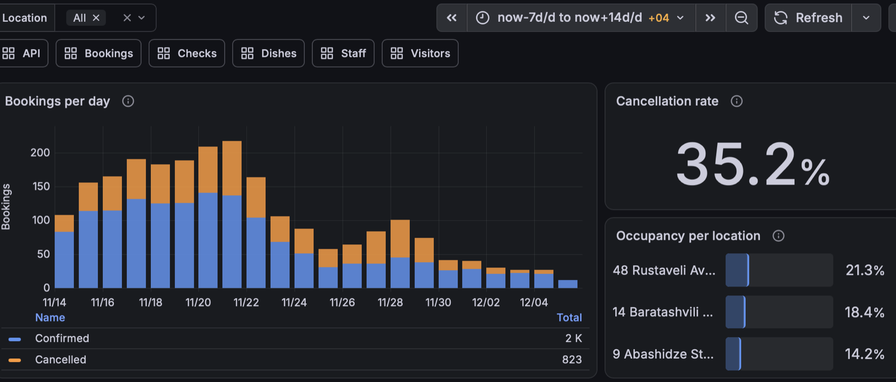
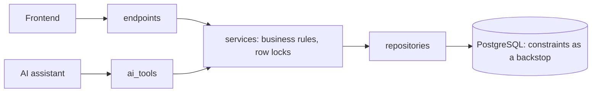
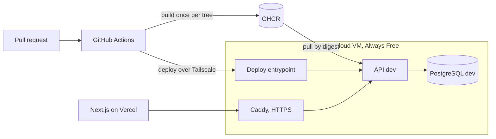
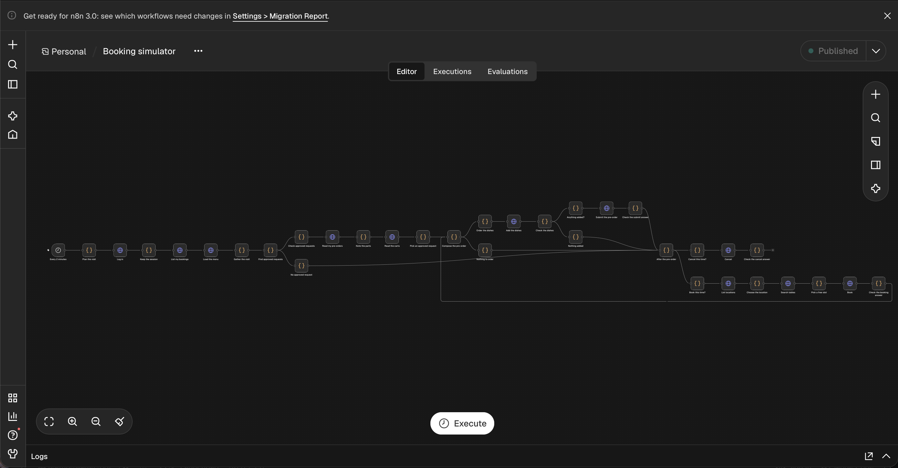
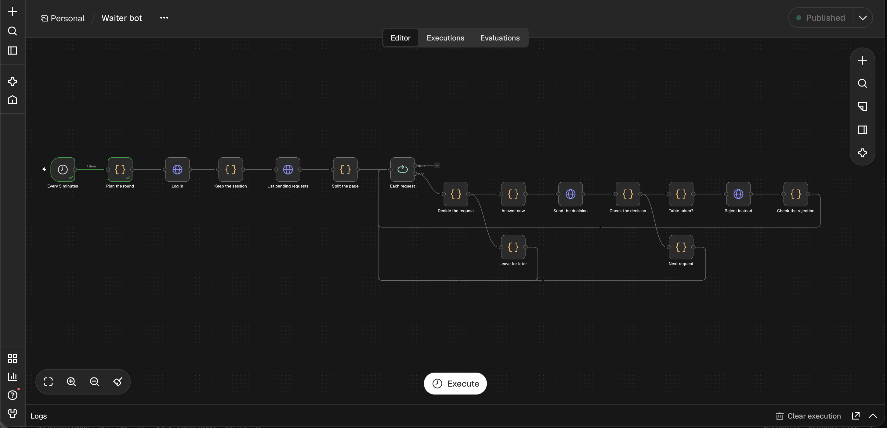
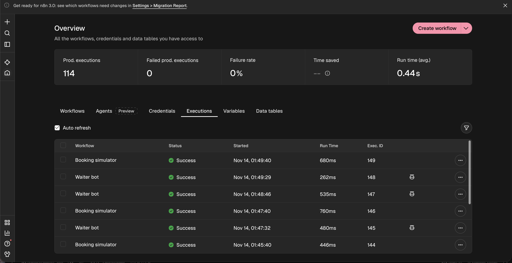
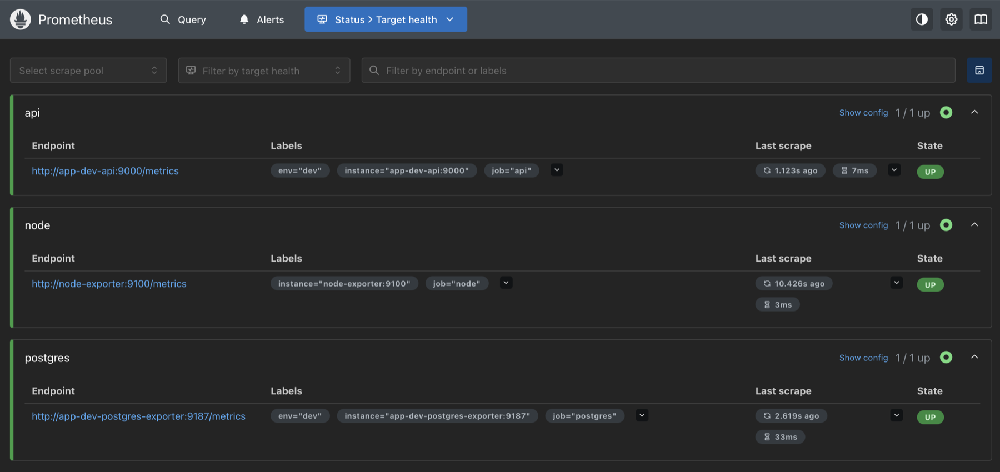
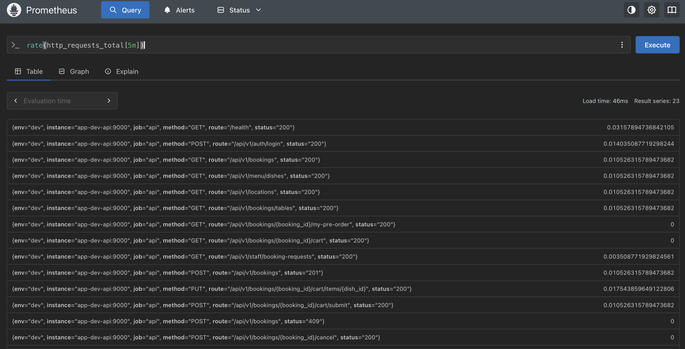
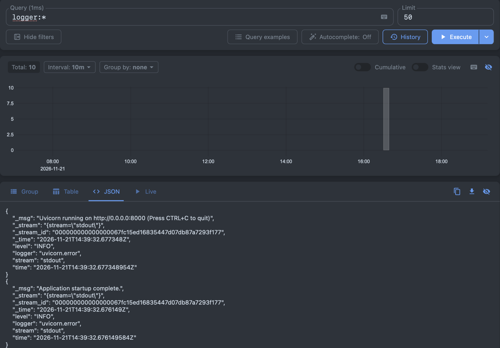

# Backend Showcase

English | [Українська](README.uk.md)

[](https://github.com/VladSkopenko/backend-showcase/actions/workflows/ci.yml)
[](https://sonarcloud.io/summary/new_code?id=VladSkopenko_backend-showcase)
[](https://sonarcloud.io/summary/new_code?id=VladSkopenko_backend-showcase)

Two things in one repository: the **backend** of a restaurant (guests book tables, invite friends,
pre-order dishes and talk to an AI assistant) and the **cloud and CI/CD** that run it live on a real
server, deployed from `main` with no manual steps, monitored, and free to run.

## Live

| What | Link |
|---|---|
| Frontend | https://family-rest.vercel.app ([source](https://github.com/LudSkop/family-rest)) |
| API docs (Swagger) | https://backend-showcase-dev.duckdns.org/docs |
| Dashboards, no account needed | https://backend-showcase-grafana.duckdns.org |
| Code quality | https://sonarcloud.io/summary/overall?id=VladSkopenko_backend-showcase |
| Prometheus, Tailscale only | https://backend-showcase-platform.tail88eb36.ts.net:9090 |
| Logs (VictoriaLogs), Tailscale only | https://backend-showcase-platform.tail88eb36.ts.net:9428/select/vmui/ |

Bots in n8n play the restaurant around the clock: guests book, pre-order and cancel, and a waiter bot
decides large-party requests, so the dashboards always move.



---

## Part 1. Backend

### What it does

- Sign up with email verification or Google; sessions with refresh-token rotation.
- Book a table on a slot grid, safe under concurrent requests; edit or cancel it.
- Invite friends by link, with or without an account.
- Pre-order per guest, with the whole group's order for the booking owner.
- Staff approve or reject large-party requests.
- An AI assistant answers about the menu and bookings and acts only through cards the guest confirms.

### How it is built


```mermaid
flowchart LR
    client[Frontend] --> ep[endpoints]
    llm[AI assistant] --> tools[ai_tools]
    ep --> svc[services: business rules, row locks]
    tools --> svc
    svc --> repo[repositories]
    repo --> db[(PostgreSQL: constraints as a backstop)]
```

- Python 3.14, FastAPI, SQLAlchemy 2 async, Alembic.
- Feature-sliced layout: core features (users, auth, menu, locations, bookings) are shared, regular
  features never import each other, and calls go one way, endpoints to services to repositories.
  import-linter enforces it in CI.
- One error format for the whole API.
- Tests run on a real PostgreSQL, because the rules that matter live in row locks and constraints.

### Where to look in the code

| What | Where |
|---|---|
| Double booking under concurrent requests: row locks plus an exclusion constraint | [booking_service.py](backend/src/app/features/core/bookings/services/booking_service.py) |
| A test that races two real transactions | [test_booking_concurrency.py](backend/tests/test_booking_concurrency.py) |
| Refresh-token rotation; a reused token revokes every session | [session_service.py](backend/src/app/features/core/auth/services/session_service.py) |
| Database errors mapped to domain errors by constraint name | [constraint_errors.py](backend/src/app/common/constraint_errors.py) |

---

## Part 2. Cloud and CI/CD

### How a commit reaches the server


```mermaid
flowchart LR
    pr[Pull request] --> ci[GitHub Actions]
    ci -->|build once per tree| ghcr[(GHCR)]
    ci -->|deploy over Tailscale| entry
    subgraph vm[Oracle Cloud VM, Always Free]
        entry[Deploy entrypoint] --> api
        caddy[Caddy, HTTPS] --> api[API dev]
        api --> pg[(PostgreSQL dev)]
    end
    ghcr -->|pull by digest| api
    web[Next.js on Vercel] --> caddy
```

### What runs it

| Part | How |
|---|---|
| CI | ruff, mypy, import-linter, migration round-trip and pytest on a real PostgreSQL for every pull request |
| Delivery | One image per git tree, scanned with Trivy, deployed by digest; CI reaches the server only through Tailscale |
| Server | Oracle Cloud VM, network and storage in Terraform; replaced, not patched |
| Platform | Caddy, n8n, Prometheus, Grafana and VictoriaLogs as code, deployed on every merge |
| Monitoring | Prometheus collects the API, the server and the database; the public Grafana shows the API traffic and the restaurant numbers |
| Logs | Fluent Bit ships every container log to VictoriaLogs, reachable only through Tailscale |
| Cost | $0: Oracle Always Free, GitHub Actions and GHCR, DuckDNS, Tailscale |

### What it looks like

<details>
<summary>n8n: the guest simulator, the waiter bot and their runs</summary>





</details>

<details>
<summary>Prometheus: the three targets and API requests by route</summary>




</details>

<details>
<summary>VictoriaLogs: the API logs as structured JSON</summary>



</details>

---

## Run it locally

From `backend/`:

```bash
uv sync
docker compose up -d                       # PostgreSQL on 127.0.0.1:5433
uv run alembic upgrade head
uv run uvicorn app.main:create_app --factory --port 8000    # http://127.0.0.1:8000/docs
uv run pytest
```
